# 🪙 สร้างเหรียญบน JIB Chain กันเถอะ

ผมชอบทิศทางของกลุ่ม [JBC — JIB ChainCommunity](https://www.facebook.com/groups/669801601275400) ตอนนี้มาก พวกเราหัดเรียนรู้หลายๆ อย่างไปด้วยกัน ไม่ว่าในอนาคตเหรียญมันจะเป็นอย่างไร อย่างน้อย ทุกคนในกลุ่มวันนี้ก็ได้เรียนรู้อะไรบางสิ่งไปแล้ว

เพื่อรักษาโมเมนตัมนี้ไว้ ผมก็เลยคิดว่า ขุดก็ขุดเป็นแล้ว งั้นลำดับถัดไป เราเอาเหรียญ JBC ที่ได้จากการขุด มาหัดเขียนโปรแกรมเล่นกันต่อดีกว่า บอกเลยว่า ใครที่เคยเขียน Node.js อยู่แล้ว จะต้องอุทานว่า ง่ายแค่นี้เองหรอ

เอาล่ะ เริ่มเลยครับ

**การเตรียมตัว**

ลง Node.js ให้เรียบร้อย แล้วแต่เลยว่าใช้ระบบปฏิบัติการอะไร มันลงได้หลายวิธี วิธีง่ายสุดก็ไปดาวน์โหลดมาติดตั้งได้เลย [https://nodejs.org/en/](https://nodejs.org/en/) แต่สำหรับใครที่เขียนโค้ดจริงจัง ผมแนะนำให้ติดตั้งผ่าน NVM ซึ่งไปอ่านรายละเอียดเต็มๆ ได้[ที่นี่](https://medium.com/ayuth/%E0%B8%A3%E0%B8%B9%E0%B9%89%E0%B8%88%E0%B8%B1%E0%B8%81-nvm-node-version-manager-%E0%B9%81%E0%B8%A5%E0%B8%B0%E0%B8%81%E0%B8%B2%E0%B8%A3%E0%B9%83%E0%B8%8A%E0%B9%89%E0%B8%87%E0%B8%B2%E0%B8%99%E0%B8%88%E0%B8%9A%E0%B8%84%E0%B8%A3%E0%B8%9A%E0%B8%97%E0%B8%B8%E0%B8%81%E0%B8%AD%E0%B8%A2%E0%B9%88%E0%B8%B2%E0%B8%87%E0%B9%83%E0%B8%99%E0%B8%9A%E0%B8%A5%E0%B9%87%E0%B8%AD%E0%B8%81%E0%B9%80%E0%B8%94%E0%B8%B5%E0%B8%A2%E0%B8%A7-e3f44545504f)

โปรแกรมเขียนโค้ดที่แนะนำ ผมแนะนำเป็น VSCode ซึ่งดาวน์โหลดได้ที่ [https://code.visualstudio.com/](https://code.visualstudio.com/)

**เตรียมตัวเรียบร้อย ก็มาลุยกัน**

บทความนี้ อาจจะแตกต่างจากบทความสอน deploy ด้วย hardhat ของที่อื่น เนื่องจาก JIB Chain นั้นรองรับ Sourcify เราจึงใช้ปลั๊กอิน hardhat-deploy ในการสร้างเหรียญ ซึ่งถ้าไปอ่าน Tutorial ที่อื่น จะไม่เหมือนแบบนี้ แต่เอา Tutorial ที่อื่นมาใช้ที่ JIB Chain ได้นะ ก็จะยุ่งยากขึ้นนิดหน่อย เนื่องจากต้อง flatten contract และ verify contract ด้วยตนเอง

1. สร้างโฟลเดอร์ใหม่ไว้เก็บงานของเรา สร้างไว้ที่ไหนก็ได้ ตัวอย่างผมสร้างโฟลเดอร์ชื่อ erc20

<figure>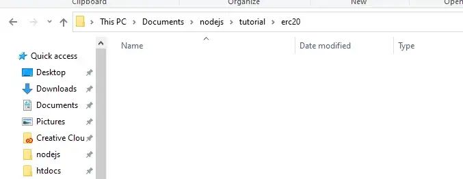<figcaption></figcaption></figure>

2\. เปิด VSCode ขึ้นมา แล้วเลือก Open Folder เลือกโฟลเดอร์ที่เราสร้างเอาไว้

<figure>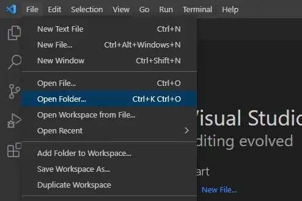<figcaption></figcaption></figure>

3\. ไปที่เมนู Terminal > New Terminal

<figure>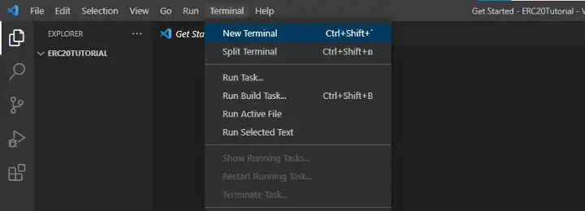<figcaption></figcaption></figure>

4\. ที่ Terminal พิมพ์คำสั่ง

```
npm init --yes
```

เป็นคำสั่งสร้างโปรเจค nodejs ขึ้นมา

<figure>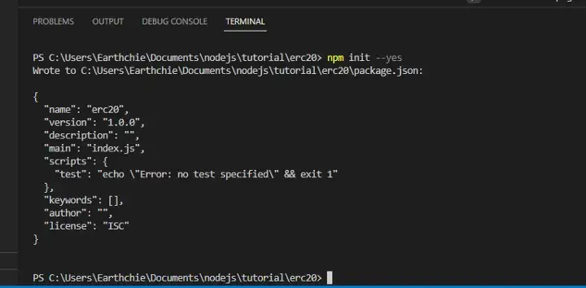<figcaption></figcaption></figure>

5\. ติดตั้ง dependency ให้เรียบร้อย ซึ่งผมลิสต์เอาไว้ให้แล้ว ก็อปไปแปะได้เลย

```
npm i hardhat ethers @openzeppelin/contracts @nomiclabs/hardhat-ethers hardhat-deploy hardhat-deploy-ethers
```

ขั้นตอนนี้รอนานหน่อยนะ ต้องโหลดไฟล์เยอะ

<figure>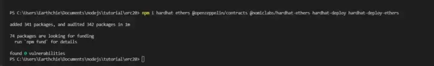<figcaption></figcaption></figure>

6\. เราจะใช้ Hardhat ซึ่งเป็นเฟรมเวิร์คด้านการพัฒนา Smart Contract ด้วยการพิมพ์คำสั่ง

```
npx hardhat
```

7\. ใช้ลูกศรบนคีย์บอด เลื่อนลงมาสองครั้ง เพื่อเลือก Create an empty hardhat.config.js

<figure>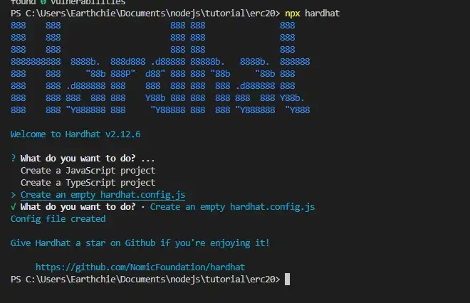<figcaption></figcaption></figure>

8\. สร้างโฟลเดอร์ไว้เก็บโค้ด smart contracts ด้วยการคลิกขวาที่แถบซ้ายมือแล้วเลือก New Folder ตั้งชื่อเป็น contracts (ถ้าไม่ตั้งตามนี้ เฟรมเวิร์คมันจะหาไม่เจอนะ)

<figure>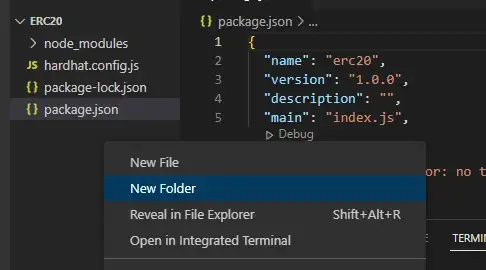<figcaption></figcaption></figure>

<figure>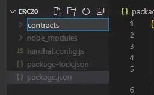<figcaption></figcaption></figure>

9\. สร้างไฟล์สำหรับเขียนโค้ด smart contract ด้วยการคลิกขวาที่โฟลเดอร์ contracts แล้วเลือก New File ตั้งชื่ออะไรก็ได้ ผมตั้งเป็น ERC-20.sol

<figure>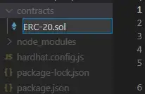<figcaption></figcaption></figure>

10\. เริ่มเขียนโค้ด Solidity กัน สำหรับใครที่เขียนเป็นอยู่แล้ว หรือมีโค้ดอยู่แล้ว ก็เชิญโซโล่ได้เลย แต่ถ้าใครยังไม่มีก็ก็อปโค้ดนี้ไปใส่ในไฟล์ ERC-20.sol ได้

โดยโค้ดชุดนี้จะเป็นเหรียญ ERC-20 Token แบบเสริม Extension เรื่องการจัดการ mint, burn เข้ามาด้วย

แก้บรรทัดที่ 13 เป็นรายละเอียดเหรียญของเรา\
แก้ ABC Token เป็นชื่อเต็มของเหรียญ\
แก้ ABC เป็นชื่อย่อของเหรียญ (แก้ให้ครบทั้งสองจุด)

นอกจากนี้ ยังสามารถแก้ชื่อ Contract ได้ด้วย โดยในโค้ดตัวอย่างจะใช้ชื่อว่า Token สามารถแก้คำว่า Token ในบรรทัดที่ 7 เป็นชื่ออื่นได้ ตามต้องการ

```
// SPDX-License-Identifier: MIT
pragma solidity ^0.8.0;
import "@openzeppelin/contracts/token/ERC20/extensions/ERC20Burnable.sol";
import "@openzeppelin/contracts/access/AccessControlEnumerable.sol";
import "@openzeppelin/contracts/token/ERC20/extensions/draft-ERC20Permit.sol";

contract Token is ERC20Burnable, AccessControlEnumerable, ERC20Permit {
    bytes32 public constant MINTER_ROLE = keccak256("MINTER_ROLE");
    bytes32 public constant BURNER_ROLE = keccak256("BURNER_ROLE");

    event Memo(string memo);

    constructor() ERC20("Thaichain Tutorial Token", "Tutorial") ERC20Permit("Tutorial") {
        _setupRole(DEFAULT_ADMIN_ROLE, msg.sender);
        _setupRole(MINTER_ROLE, msg.sender);
        _setupRole(BURNER_ROLE, msg.sender);
    }

    modifier onlyMinter() {
        require(hasRole(MINTER_ROLE, msg.sender), "Caller is not a minter");
        _;
    }

    modifier onlyBurner() {
        require(hasRole(BURNER_ROLE, msg.sender), "Caller is not a burner");
        _;
    }

    modifier onlyAdmin() {
        require(hasRole(DEFAULT_ADMIN_ROLE, msg.sender), "Caller is not a admin");
        _;
    }

    function mint(address receiver, uint256 amount) external onlyMinter {
        _mint(receiver, amount);
    }

    function grantMinter(address minter) external onlyAdmin {
        grantRole(MINTER_ROLE, minter);
    }

    function revokeMinter(address minter) external onlyAdmin {
        revokeRole(MINTER_ROLE, minter);
    }

    function burn(address account, uint256 amount) external onlyBurner {
        _burn(account, amount);
    }

    function grantBurner(address burner) external onlyAdmin {
        grantRole(BURNER_ROLE, burner);
    }

    function revokeBurner(address burner) external onlyAdmin {
        revokeRole(BURNER_ROLE, burner);
    }

    function _afterTokenTransfer(address from, address to, uint256 amount) internal override(ERC20) {
        super._afterTokenTransfer(from, to, amount);
    }

    function _mint(address to, uint256 amount) internal override(ERC20){
        super._mint(to, amount);
    }

    function _burn(address account, uint256 amount) internal override(ERC20){
        super._burn(account, amount);
    }

    function transfer(address recipient, uint256 amount, string memory memo) public {
        if (transfer(recipient, amount)) {
            if (bytes(memo).length > 0) {
                emit Memo(memo);
            }
        }
    }

    function transferFrom(address sender, address recipient, uint256 amount, string memory memo) public {
        if (transferFrom(sender, recipient, amount)) {
            if (bytes(memo).length > 0) {
                emit Memo(memo);
            }
        }
    }
}
```

<figure>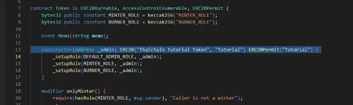<figcaption></figcaption></figure>

11\. สร้างโฟลเดอร์ deploy เพื่อใช้เก็บ deploy script

<figure>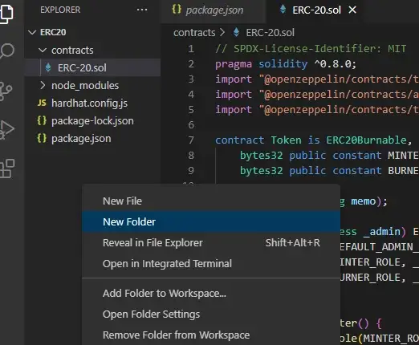<figcaption></figcaption></figure>

<figure>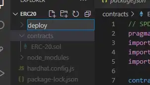<figcaption></figcaption></figure>

12\. สร้างไฟล์ชื่อ Token.js ภายในโฟลเดอร์ deploy (ตั้งชื่ออื่นก็ได้)

<figure>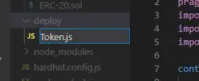<figcaption></figcaption></figure>

13\. เขียน deploy script โดยการ copy โค้ดนี้ไปไว้ในไฟล์ ./deploy/Token.js

```
module.exports = async ({ getNamedAccounts, deployments }) => {
    const { deployer } = await getNamedAccounts();
    const { deploy } = deployments;

    await deploy('Token', {
        from: deployer,
        log: true,
        deterministicDeployment: false
    });

};
module.exports.tags = ['Token'];
```

สังเกตบรรทัดสุดท้ายให้ดี เรา export tags ไปว่า Token เราจะเรียกใช้แท็กนี้ตอน deploy ด้วยในภายหลัง ถ้าเปลี่ยนไปใช้ชื่ออื่นก็ขอให้เข้าใจว่า ต้องการอ้างอิงถึงไฟล์ deploy script ไฟล์ไหน ให้เรียกแท็กนั้น

14\. มาแก้ไขไฟล์ hardhat.config.js เพื่อเตรียม deploy smart contract กัน ด้วยการเปิดไฟล์ hardhat.config.js ขึ้นมา แล้ววางโค้ดด้านล่างนี้ ลงไปแทนโค้ดเดิมได้เลย อย่าลืมกำหนดกระเป๋าที่ใช้ในการ Deploy Contract ด้วยล่ะ เอา private key มาใส่ในบรรทัดที่ 4

```
require('hardhat-deploy');
require('hardhat-deploy-ethers');

const deployer = ['0xprivate_key_ของเรา']; // อย่าลืมเติม JBC ไว้จ่ายค่า gas

module.exports = {
  solidity: {
    version: '0.8.17',
    settings: {
      optimizer: {
        enabled: true // optional, occasionally make tx gas cheaper.
      }
    }
  },
  namedAccounts: {
    deployer: 0,
  },
  networks: {
    JBC: {
      url: "https://rpc-l1.jibchain.net",
      chainId: 8899,
      accounts: deployer
    }
  }
};
```

15\. เริ่ม Deploy smart contract ได้เลย ด้วยคำสั่ง

```
npx hardhat deploy --network JBC --tags Token
```

อย่าลืมเช็คให้แน่ใจว่ากดเซฟไฟล์ที่ทำทุกไฟล์แล้วก่อนสั่ง deploy ล่ะ

<figure>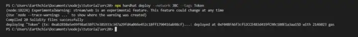<figcaption></figcaption></figure>

16\. contract address ของเราจะอยู่ถัดจากคำว่า deployed at

<figure>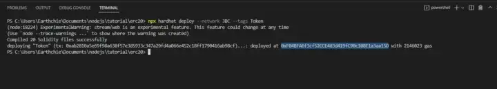<figcaption></figcaption></figure>

17\. อย่าเพิ่งไปไหน ทำการ verify contract ต่อเลย ด้วยคำสั่ง

```
npx hardhat sourcify --network JBC --endpoint https://trustcontract.dev/server
```

<figure>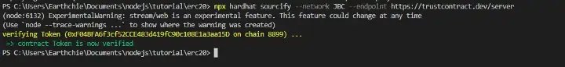<figcaption></figcaption></figure>

ขึ้นแบบนี้ ก็ถือว่าเสร็จเรียบร้อย

18\. ต่อไปลองไปดูผลลัพธ์บน Explorer กัน ด้วยการก็อปปี้ contract address ของเรา ไปค้นหาที่ [https://exp-l1.jibchain.net/](https://exp-l1.jibchain.net/)

<figure>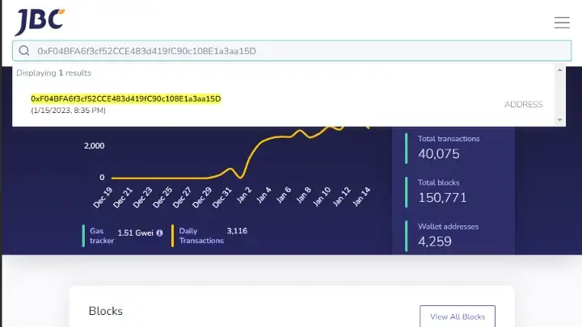<figcaption></figcaption></figure>

<figure>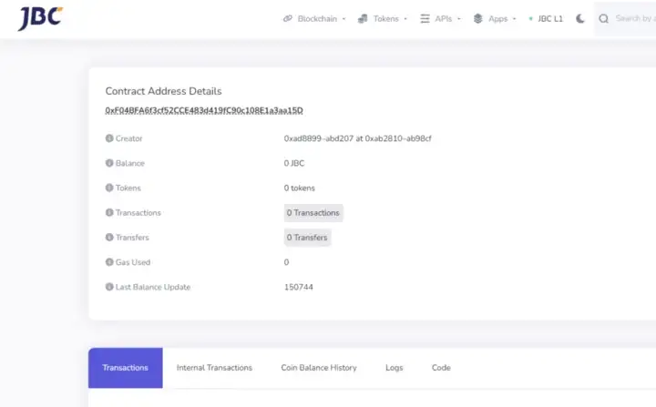<figcaption></figcaption></figure>

19\. ไปที่แท็ป Code จะพบว่า Smart Contract ถูก Verify แล้วเรียบร้อย นี่แหละข้อดีของการที่บล็อกเชนรองรับ Sourcify ซึ่งถือว่าเป็นฟีเจอร์เด็ดอีกอย่างนึงของ JIB Chain

<figure>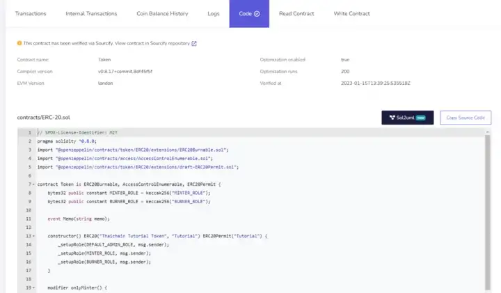<figcaption></figcaption></figure>

20\. เอาล่ะ ตอนนี้ เหรียญของเรายังมี 0 อยู่เลย งั้นต่อไปเรามา mint เหรียญกัน ด้วยการไปที่แท็ป Write Contract

<figure>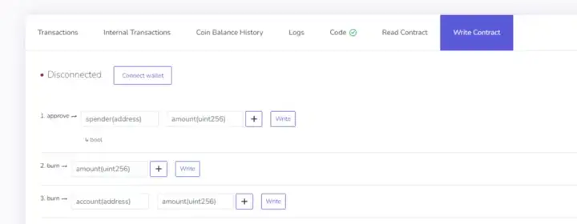<figcaption></figcaption></figure>

21\. กด Connect Wallet แล้วเลือก Metamask หรือใครใช้ Wallet Connect เป็น จะใช้ตัวนั้นก็ได้ จากนั้นเลือกเชื่อมต่อเข้ากับกระเป๋าที่เราใช้ Deploy Wallet ไปในขั้นตอนที่ 14 เนื่องจากถือเป็น admin ของ contract นี้ และมีสิทธิ์ mint เหรียญ

<figure>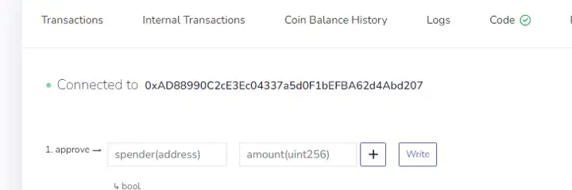<figcaption></figcaption></figure>

22\. เลื่อนไปยังคำสั่งรายการที่ 10 mint ช่องแรก กรอกหมายเลขกระเป๋าผู้รับเหรียญลงไป ช่องที่สอง กรอกจำนวนที่ต้องการ mint โดยระบุจำนวนที่ต้องการลงไปแล้วเติมศูนย์ตามหลังไปด้วยอีก 18 ตัว

เช่น จะ mint 1 เหรียญ ก็ใส่ 1 ตามด้วยศูนย์ 18 ตัว\
กลายเป็น `1000000000000000000`

ถ้าจะ mint 1 ล้านเหรียญก็จะเป็นเลข\
`1000000000000000000000000`

เหตุผลที่ต้องทำแบบนี้ก็เพราะว่าเหรียญของเรารองรับทศนิยม 18 หลัก

เมื่อกรอกข้อมูลครบแล้ว กด Write

<figure>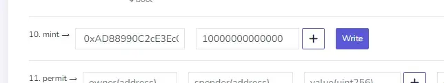<figcaption></figcaption></figure>

23\. Metamask จะเด้งขึ้นมาให้เรากดยืนยันการทำธุรกรรม เราสามารถกด confirm ได้เลย

<figure>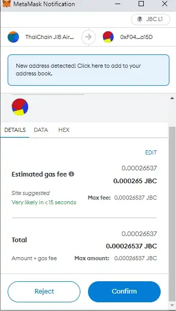<figcaption></figcaption></figure>

24\. เมื่อ mint เสร็จแล้ว จะขึ้นหน้าต่างแบบนี้

<figure><figcaption></figcaption></figure>

25\. เมื่อไปดูที่กระเป๋าเรา ก็จะพบเหรียญจำนวน 1 ล้านเหรียญ

<figure>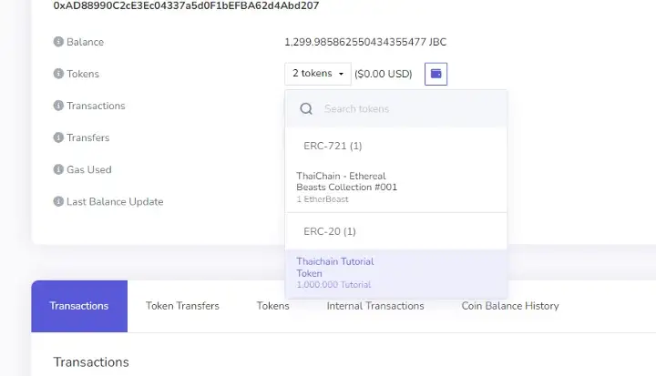<figcaption></figcaption></figure>

26\. เราสามารถเอา contract address ของเหรียญเรา (ที่ได้ในขั้นตอน 16) ไปเพิ่มใน Metamask ตามปกติได้เช่นกัน

<figure>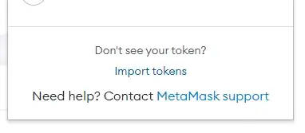<figcaption><p>ที่หน้า Metamask กด Import Token</p></figcaption></figure>

<figure>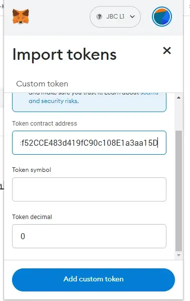<figcaption><p>กรอก Contract Address ลงไปในช่องแรก</p></figcaption></figure>

<figure>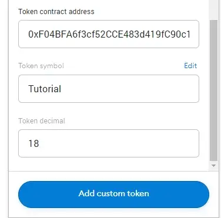<figcaption><p>ช่องที่เหลือ ก็จะถูกกรอกให้โดย Metamask โดยอัตโนมัติ</p></figcaption></figure>

<figure>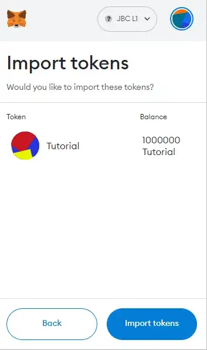<figcaption><p>Import tokens เพื่อยืนยัน</p></figcaption></figure>

<figure>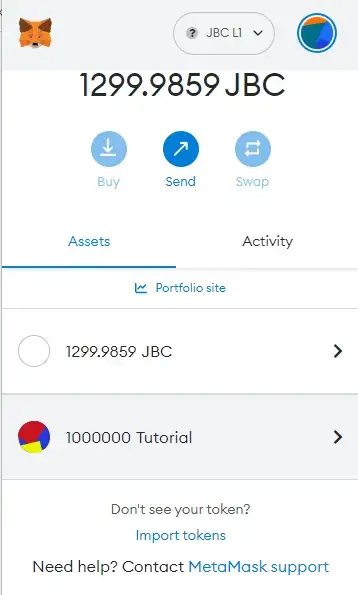<figcaption><p>1,000,000 Tutoral Token ปรากฎใน Metamask แล้ว</p></figcaption></figure>

เสร็จเรียบร้อยครับ ขั้นตอนดูเหมือนยาว แต่ทำจริงๆ ใช้เวลาไม่นานครับ ลองทำดูกันนะครับเพื่อนๆ&#x20;
